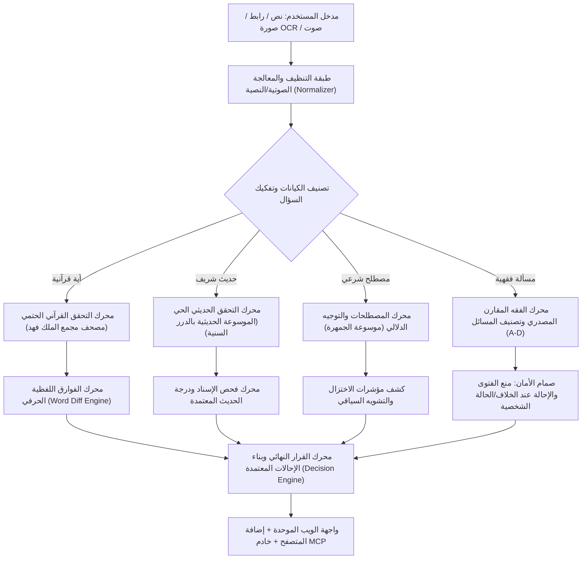

# 🛡️ بصيرة — BASEERA
### المنظومة الذكية الموحدة للتحقق من المحتوى الإسلامي، إعداد الخطب والمقالات، وتمكين المعرّفين بالإسلام
**تحدي الذكاء الاصطناعي في خدمة المحتوى الإسلامي — المسار المفتوح: الدمج بين المسار الرابع ("أدوات المعرفة والتحقق لتمكين المعرّفين بالإسلام") والمسار الثاني ("المحتوى الدعوي وتطويره وإعداد الخطب والمقالات") معًا**

[](https://baseera.onrender.com)
[-10b981?style=for-the-badge)](/#/benchmark)
[](/#/benchmark)
[](LICENSE)

---

> ### 📜 المبدأ الحاكم لمنظومة بصيرة:
> **«الذكاء الاصطناعي يفهم ويسترجع، والمصدر المعتمد وحده هو الذي يحكم ويوثّق»**
> 
> لا يُسمح للنموذج اللغوي (LLM) باختلاق نص قرآني، أو تصحيح حديث نبوي، أو انتحال فتوى شخصية. دوره محصور في: فهم المدخل، استخراج الكيانات، وتسهيل الاسترجاع من المصادر الرسمية المعتمدة. أما الحكم التوثيقي فمبني حتمياً على المطابقة الحرفية مع المصادر الشرعية. وعند غياب الدليل: الامتناع الصارم أو الإحالة إلى الجهات المختصة.

---

## 📑 فهرس المحتويات
1. [المشكلة والقيمة المضافة](#1-المشكلة-والقيمة-المضافة)
2. [الأركان الأربعة لمنظومة بصيرة](#2-الأركان-الأربعة-لمنظومة-بصيرة)
3. [معمارية النظام والتدفق التقني (RAG & Multi-Engine)](#3-معمارية-النظام-والتدفق-التقني)
4. [سجل المراجع والمصادر المعتمدة](#4-سجل-المراجع-والمصادر-المعتمدة)
5. [مستويات اتخاذ القرار والحوكمة الشرعية (Levels A–D)](#5-مستويات-اتخاذ-القرار-والحوكمة-الشرعية)
6. [نتائج الاختبارات القياسية (Benchmark & Zero FCR)](#6-نتائج-الاختبارات-القياسية)
7. [صانع المحتوى الدعوي والخطب (Dawah & Khutbah Studio)](#7-صانع-المحتوى-الدعوي-والخطب)
8. [إضافة المتصفح الذكية (Chrome Extension - Manifest V3)](#8-إضافة-المتصفح-الذكية)
9. [بروتوكول سياق النماذج (Model Context Protocol - MCP)](#9-بروتوكول-سياق-النماذج-mcp)
10. [دليل التثبيت والتشغيل المحلي](#10-دليل-التثبيت-والتشغيل-المحلي)
11. [دليل النشر السحابي خطوة بخطوة على Render](#11-دليل-النشر-السحابي-على-render)

---

## 1. المشكلة والقيمة المضافة

يواجه الدعاة، والمترجمون، وصنّاع المحتوى، والمعرّفون بالإسلام تحديات تقنية وحرجة تهدد سلامة الرسالة الدعوية:
1. **معضلة الهلوسة والتأكيد الزائف (LLM Hallucinations & False Confirmation):**
   تؤكد النماذج اللغوية العامة صحة نصوص قرآنية محرّفة أو مبدلة الألفاظ، وتنسب أحاديث لا أصل لها للنبي ﷺ، أو تختلق أرقام السور والتخريجات بدقة وهمية.
2. **اختزال وتشويه المصطلحات الإسلامية الكبرى:**
   ترجمة مصطلحات مثل (الجهاد، الشريعة، التوحيد، القوامة، الحجاب) بترجمات استشراقية أو اختزالية تفصل المصطلح عن سياقه الشرعي الأصيل.
3. **التصدر الفقهي وإصدار الفتاوى الشخصية الحساسة:**
   إطلاق أحكام قطعية في مسائل الخلاف المعتبر، أو الإفتاء الآلي في قضايا النكاح والطلاق والمعاملات المالية بدلاً من توجيه السائل للجهات المعتمدة.

### كيف تحل «بصيرة» هذه المشكلة؟
* **فصل صارم بين الاسترجاع والحكم:** الاعتماد الحصري على المصادر الرقمية الرسمية المعتمدة (مصحف مجمع الملك فهد، الدرر السنية، موسوعة الجمهرة، المستودع الدعوي).
* **فحص الفوارق اللفظية على مستوى الكلمة (Word-Level Diffing):** تلوين الفوارق بدقة (مطابق، مبدل، ناقص، زائد) لمنع أي تحريف في كلام الله ورسوله.
* **سياسة الصفر تسامح مع التأكيد الخاطئ (0.0% False Confirmation Rate):** الامتناع والإحالة فوراً عند عدم ثبوت النص أو كونه مسألة فقهية شخصية.

---

## 2. الأركان الأربعة لمنظومة بصيرة

```text
┌────────────────────────────────────────────────────────────────────────┐
│                        منظومة بصيرة — BASEERA                         │
├───────────────────┬───────────────────┬────────────────────────────────┤
│ 1. محرك الفحص     │ 2. صانع المحتوى   │ 3. إضافة المتصفح │ 4. بروتوكول │
│    متعدد الوسائط  │    الدعوي والخطب  │    (Extension)   │    سياق MCP │
├───────────────────┼───────────────────┼──────────────────┼─────────────┤
│ • نصوص وروابط     │ • خطب جمعة كاملة  │ • فحص بالنقر     │ • أداة MCP  │
│ • صور (OCR)       │ • مقالات مؤصلة    │ • تظليل النصوص   │   لـ Claude │
│ • صوت (STT)       │ • إنفوجرافيك SVG  │ • صور السوشيال   │ • RAG فوري  │
│ • تفنيد الفوارق   │ • سيناريو ريلز    │ • 3 لغات حيّة    │ • مفتوح     │
└───────────────────┴───────────────────┴──────────────────┴─────────────┘
```

---

## 3. معمارية النظام والتدفق التقني

تعتمد المنظومة بنية هجينة تدمج بين الذكاء الاصطناعي الدلالي (Groq - Llama 3.3 70B / OSS-120B) وخوارزميات المطابقة الحتمية الصارمة (Deterministic Verification Engines):



---

## 4. سجل المراجع والمصادر المعتمدة وروابطها وآلية توظيفها

تلتزم المنظومة بسجل صارم لا يسمح بتمرير أي استشهاد دون أن يكون موصولاً بمرجعه الرقمي المعتمد، وتفصل تماماً بين فهم النموذج اللغوي وحكم المصدر الشرعي.

### جدول المصادر المعتمدة والروابط الحية:

| النطاق الشرعي | المصدر المعتمد | الجهة والمشرف العلمي | الرابط الرسمي الحي | الملف البرمجي المنفّذ |
| :--- | :--- | :--- | :--- | :--- |
| **القرآن الكريم** | مصحف مجمع الملك فهد بالرسم العثماني | مجمع الملك فهد لطباعة المصحف الشريف | [quranpedia.net](https://quranpedia.net/) | [`src/lib/quranVerifier.ts`](src/lib/quranVerifier.ts) |
| **ترجمات القرآن** | صحيح إنترناشونال / إلمير كولييف | مجمع الملك فهد ومترجمون معتمدون | [quranpedia.net](https://quranpedia.net/) | [`src/lib/quranpediaClient.ts`](src/lib/quranpediaClient.ts) |
| **الحديث النبوي** | الموسوعة الحديثية | مؤسسة الدرر السنية للإشراف العلمي | [dorar.net/hadith](https://dorar.net/hadith) | [`src/lib/dorarClient.ts`](src/lib/dorarClient.ts) |
| **شروح وتراجم الحديث** | موسوعة الحديث النبوي الشريف | HadeethEnc — موسوعة الأحاديث النبوية | [hadeethenc.com](https://hadeethenc.com/) | [`src/lib/islamicContentMcpClient.ts`](src/lib/islamicContentMcpClient.ts) |
| **المصطلحات الشرعية** | موسوعة الجمهرة لمفردات المحتوى الإسلامي | مركز معاهد / جامعة الإمام محمد بن سعود | [islamic-content.com](https://islamic-content.com/raw/jamhara/terms) | [`src/lib/jamharaClient.ts`](src/lib/jamharaClient.ts) |
| **الفقه المقارن** | الموسوعة الفقهية المقارنة | مؤسسة الدرر السنية | [dorar.net/feqhia](https://dorar.net/feqhia) | [`src/lib/fiqhVerifier.ts`](src/lib/fiqhVerifier.ts) |
| **المحتوى الدعوي والخطب** | المستودع الدعوي الرقمي | dawa.center | [dawa.center](https://dawa.center/) | [`src/lib/dawahGenerator.ts`](src/lib/dawahGenerator.ts) |
| **بروتوكول المحتوى الإسلامي** | خادم MCP للمحتوى الإسلامي باللغات | جمعية خدمة المحتوى الإسلامي باللغات | [mcp.islamiccontent.org](https://mcp.islamiccontent.org/) | [`src/lib/islamicContentMcpClient.ts`](src/lib/islamicContentMcpClient.ts) |
| **خادم MCP لبصيرة** | Baseera MCP Server (JSON-RPC 2.0) | مشروع بصيرة (أدوات التحقق لبيئات الذكاء الاصطناعي) | محلياً عبر `stdio` | [`mcp-server.ts`](mcp-server.ts) |

---

### كيف تستخدم منظومة «بصيرة» كل مصدر تقنياً ومعمارياً؟

#### 1. القرآن الكريم وترجماته (مصحف مجمع الملك فهد عبر Quranpedia)
* **المسار البرمجي:** [`src/lib/quranVerifier.ts`](src/lib/quranVerifier.ts) و [`src/lib/quranpediaClient.ts`](src/lib/quranpediaClient.ts) و [`src/lib/normalizer.ts`](src/lib/normalizer.ts).
* **طريقة الاستخدام:**
  1. **فهرس حتمي محلي كامل:** يحتوي على كافة آيات القرآن الكريم برواية حفص عن عاصم (6,236 آية) ببيانات السور والأرقام ورسم المصحف وعلامات الضبط.
  2. **استعلام حي (Live API):** يتصل حياً بواجهة `Quranpedia` لجلب نص الآية المعتمد وترجماتها الرسمية الموثقة (مثل *Saheeh International* بالإنجليزية، و*Elmir Kuliev* بالروسية).
  3. **محرك الفوارق اللفظية (Word-Level Diff Engine):** يقوم بمقارنة دقيقة لكل كلمة في النص المدخل مع النص القرآني المعتمد؛ فيكشف الزيادة والنقصان والتبديل ويبرزها بصرياً (أخضر للمطابق، أحمر مشطوب للمحذوف، أحمر مائل للمبدل).
  4. **حظر الترجمة الذاتية:** يُمنع النموذج التوليدي قطعياً من توليد ترجمات لمعاني القرآن من تلقاء نفسه، ويُلزم باسترجاع الترجمة الرسمية المعتمدة فقط.

#### 2. الحديث النبوي الشريف (الموسوعة الحديثية بالدرر السنية)
* **المسار البرمجي:** [`src/lib/dorarClient.ts`](src/lib/dorarClient.ts) و [`src/lib/hadithVerifier.ts`](src/lib/hadithVerifier.ts).
* **طريقة الاستخدام:**
  1. **محرك استعلام وتوسيع بحث ذكي:** يستخرج الكلمات المفتاحية من المدخل ويولد مسارات بحث متعددة لضمان العثور على متن الحديث حتى مع اختلاف الألفاظ أو الروايات.
  2. **استخراج تفصيلي لعناصر التخريج:** يستخرج حياً من منصة الدرر: (نص المتن، الراوي، المحدث، الكتاب الأصلي، الجزء والصفحة، وحكم المحدث المعتمد: صحيح، حسن، ضعيف، منكر، موضوع، لا أصل له).
  3. **إلزامية الرابط الدائم (Strict Permalink Enforcement):** يشترط محرك الفحص وجود رابط دائم حقيقي للحديث على صيغة (`https://dorar.net/h/<id>`)؛ ولا يقبل النظام رابط البحث العام كتوثيق.
  4. **الانغلاق الأمني التلقائي (Fail-Closed):** إذا كان الحديث موضوعاً أو ضعيفاً أو مكذوباً، تطلق المنظومة فوراً حكماً تحذيرياً صريحاً وتمنع إدراجه أو تصحيحه كحجة شرعية.

#### 3. موسوعة الحديث المعتمدة (HadeethEnc)
* **المسار البرمجي:** [`src/lib/islamicContentMcpClient.ts`](src/lib/islamicContentMcpClient.ts).
* **طريقة الاستخدام:**
  * تُستدعى عبر بروتوكول MCP لجلب متون الأحاديث النبوية وشروح الكلمات الغريبة والفوائد الدعوية والترجمات المعتمدة، مع ربط كل حديث بصفحته الدائمة الموثقة على منصة [hadeethenc.com](https://hadeethenc.com/).

#### 4. موسوعة المصطلحات الشرعية (الجمهرة)
* **المسار البرمجي:** [`src/lib/jamharaClient.ts`](src/lib/jamharaClient.ts) و [`src/lib/termVerifier.ts`](src/lib/termVerifier.ts).
* **طريقة الاستخدام:**
  1. **فحص المفاهيم الحساسة:** تستهدف الكلمات التي تتعرض للاختزال أو التشويه الدلالي في الترجمات أو النماذج اللغوية (مثل: الجهاد، الشريعة، التوحيد، القوامة، الجزية، الحجاب، الولاء والبراء).
  2. **استرجاع التعريف المعتمد:** جلب التعريف الأصيل والسياق الشرعي المتكامل من منصة الجمهرة التابعة للمحتوى الإسلامي.
  3. **رصد مؤشرات التشويه (Framing Indicators):** تحليل السياق؛ فإذا وُجد اختزال (مثل حصر الجهاد في "الحرب العدوانية"، أو اختزال الشريعة في "العقوبات الجسدية فقط")، تصدر المنظومة تنبيهاً دلالياً مع عرض البيان التأصيلي الموثق.

#### 5. الفقه المقارن وضوابط الفتوى (الموسوعة الفقهية بالدرر السنية والمذاهب الأربعة)
* **المسار البرمجي:** [`src/lib/fiqhVerifier.ts`](src/lib/fiqhVerifier.ts) و [`src/lib/decisionPolicy.ts`](src/lib/decisionPolicy.ts) و [`src/lib/dorar_feqhia.py`](src/lib/dorar_feqhia.py).
* **طريقة الاستخدام:**
  1. **تصنيف المسائل وفق نموذج الحوكمة (A–D):**
     * المسائل الإجماعية القطعية (**المستوى أ**): تُوثّق مع ذكر الإجماع ومصدره.
     * مسائل الخلاف السائغ بين المذاهب الأربعة (**المستوى ج**): استعراض أقوال الأئمة (الحنفي، المالكي، الشافعي، الحنبلي) بحياد علمي تام ودون ترجيح آلي مجتزأ.
     * الفتاوى الشخصية وقضايا النوازل والطلاق والمال (**المستوى د**): تفعيل **صمام المنع الصارم**؛ حيث يحظر على الذكاء الاصطناعي إصدار أي فتوى، ويُعاد بيان الأصل العام مع إحالة السائل فوراً إلى دور الإفتاء والهيئات الرسمية.

#### 6. المستودع الدعوي وتوليد المحتوى (Dawa Center)
* **المسار البرمجي:** [`src/lib/dawahGenerator.ts`](src/lib/dawahGenerator.ts) و [`src/components/DawahStudioView.tsx`](src/components/DawahStudioView.tsx).
* **طريقة الاستخدام:**
  1. **التأطير الموضوعي:** استلهام محاور الخطب والمقالات وموضوعات التوعية المعاصرة من المستودع الدعوي الرقمي ([dawa.center](https://dawa.center/)).
  2. **التوليد بعد التوثيق الصارم:** لا يُسمح بإخراج خطبة جمعة أو مقال أو سيناريو ريلز إلا بعد التحقق الحي من صحة الأحاديث الواردة وثبوت الآيات القرآنية بروابطها الحية.

#### 7. خادم وعميل بروتوكول سياق النماذج (MCP - Model Context Protocol)
* **المسار البرمجي:** [`mcp-server.ts`](mcp-server.ts) و [`src/lib/islamicContentMcpClient.ts`](src/lib/islamicContentMcpClient.ts).
* **طريقة الاستخدام على مستويين:**
  * **بصيرة كعميل (MCP Client):** تتصل سحابياً بنقطة نهاية `https://mcp.islamiccontent.org/mcp` التابعة لجمعية خدمة المحتوى الإسلامي باللغات، للوصول إلى أدوات البحث في القرآن والحديث ومكتبة IslamHouse.
  * **بصيرة كخادم (MCP Server مستقل):** توفر بصيرة خادم MCP محلياً متوافقاً مع مواصفات Anthropic عبر `stdio`، يصدّر 4 أدوات توثيقية رئيسية:
    1. `verify_quran_verse`: فحص وتصحيح الآيات ومطابقتها حرفياً مع مصحف مجمع الملك فهد.
    2. `search_dorar_hadith`: البحث في الموسوعة الحديثية بالدرر السنية واستخراج درجة الحديث وتخريجه ورابطه الدائم.
    3. `lookup_jamhara_term`: فحص المصطلحات وكشف مؤشرات التشويه والاختزال عبر الجمهرة.
    4. `check_fiqh_ruling`: تصنيف المسائل الفقهية وضمان عدم إصدار فتاوى آلية في قضايا الأفراد.
    * هذا الخادم يتيح لبيئات مثل **Claude Desktop** و**Cursor** ووكلاء الذكاء الاصطناعي الخارجيين الاعتماد على «بصيرة» كمرجع أمان وحوكمة شرعية حتمية.

> **⛔ المصادر المحظورة قطعيًا كسلطة دينية:** ويكيبيديا، محركات البحث العامة كحكم ديني، المنتديات الحوارية، وسائل التواصل الاجتماعي، المدونات غير المحققة، وإجابات النماذج اللغوية التوليدية غير المسندة.

---

## 5. مستويات اتخاذ القرار والحوكمة الشرعية

| المستوى | طبيعة المسألة | سلوك منظومة بصيرة | النتيجة المعروضة |
| :--- | :--- | :--- | :--- |
| **المستوى أ (Level A)** | معلومة مستقرة وأدلة قطعية | توثيق مباشر مع استرجاع الآية أو الحديث الصحيح أو الإجماع | `MATCHED` (مطابق للمصدر) |
| **المستوى ب (Level B)** | شرح واستدلال تربوي | بيان الدلالة المعتمدة مع إظهار المرجع المصدري الموثق | `MATCHED / NEEDS_REVIEW` |
| **المستوى ج (Level C)** | مسائل خلافية بين الأئمة | استعراض آراء المذاهب الأربعة بحياد تام دون ترجيح آلي | `NEEDS_REVIEW` (بيان الخلاف) |
| **المستوى د (Level D)** | فتاوى أو قضايا شخصية خاصة | **الامتناع الصارم** عن الإفتاء، وتقديم أصل عام مع إحالة فورية | `REFER_TO_SPECIALIST` (إحالة) |

---

## 6. نتائج الاختبارات القياسية (Frozen Decision-Policy Benchmark)

تم إخضاع منظومة «بصيرة» لمعيار قياسي مجمّد (**Frozen Benchmark**) يضم **150 حالة اختبار منهجية ومثبتة برمجياً** تغطي كافة التخصصات الشرعية والأخطار التوليدية:
* 📖 **45 حالة قرآنية:** (تطابق تام، اقتباسات مجتزأة، كشف التبديل والتحريف اللفظي عبر Word Diff، أرقام آيات محرفة، نصوص مفتراة).
* 📜 **60 حالة حديثية:** (أحاديث صحيحة، أحاديث ضعيفة، أحاديث موضوعة ومكذوبة، نصوص لا أصل لها، عزو خاطئ للكتب).
* 📚 **20 حالة مصطلحات شرعية:** (مصطلحات معتمدة ومطابقة لموسوعة الجمهرة، ورصد الاستخدامات المختزلة أو المشوهة).
* ⚖️ **20 حالة فقهية:** (مسائل إجماعية قطعية Level A، مسائل خلافية بين المذاهب الأربعة Level C، واستفتاءات شخصية محالة فوراً Level D).
* 🔀 **5 حالات تداخل بين المصادر (Cross-Source):** (كشف خلط النصوص بين القرآن والحديث والعزو المعكوس).

### النتائج المحققة والمثبتة برمجياً:
* 🎯 **نسبة الدقة العامة (Overall Accuracy):** `100.0%` (150 / 150 نجاح تام).
* 🛡️ **معدل التأكيد الخاطئ (False Confirmation Rate - FCR):** `0.0%` (صفر مطلق — انغلاق أمان Fail-Closed ضد أي نص محرف أو حديث غير ثابت).
* 🛑 **دقة الامتناع والإحالة (Abstention Accuracy):** `100.0%` (إحالة كاملة لكافة الفتاوى الشخصية والاستفسارات غير الثابتة).
* 🔄 **درجة الاستقرار الحتمي (Consistency Score):** `100.0%` (استقرار كامل ومطابقة تامة عند تكرار الفحص برمجياً).
* ⏱️ **سرعة الفحص الحتمي:** يُقاس زمن التنفيذ حيًا عبر `performance.now()` ويُنفذ كامل المعيار (150 حالة) في أقل من ثانية واحدة محلياً.

> 💡 **إعادة تشغيل الاختبارات وبوابة التحكيم:**
> يمكن التحقق من كافة حالات الاختبار الـ 150 وبوابة التحكيم المكونة من 36 فحصاً في أي وقت عبر الأمر:
> ```bash
> npm test
> ```

---

## 7. صانع المحتوى الدعوي والخطب

قسم متكامل يترجم مبدأ **«التوليد بعد التوثيق الصارم»**، يتيح للدعاة والخطباء إنتاج:
1. **خطب جمعة متكاملة بأركانها:**
   * الخطبة الأولى: استهلال بالحمد والشهادتين والتقوى، بسط الموضوع، شرح الآيات والأحاديث المسترجعة، والاستغفار.
   * الخطبة الثانية: وصايا تطبيقية معاصرة، توجيهات أسرية ومجتمعية، ودعاء مأثور جامع.
2. **مقالات دعوية مؤصلة:**
   * مقدمة فكرية رصينة، المحور القرآني، الهدي النبوي وتخريج الأحاديث، التطبيقات المعاصرة، والخاتمة.
3. **بطاقات إنفوجرافيك تفاعلية عالية الدقة (1080 × 1080 بكسل - SVG):**
   * تصميم إسلامي فاخر جاهز للتنزيل المباشر والنشر على إنستغرام وواتساب وتيليجرام.
4. **سيناريوهات ريلز وفيديوهات قصيرة (Reels / Shorts Script):**
   * سيناريو مقسم إلى مشاهد مع توجيهات بصرية وصوتية وترشيحات لأدوات المونتاج المجانية.
5. **دعم كامل لـ 3 لغات:** (العربية، الإنجليزية، والروسية) مع الترجمات المعتمدة الرسمية.

---

## 8. إضافة المتصفح الذكية

إضافة متصفح مبنية بأحدث معايير كروم (**Manifest V3**) تتصل بالخادم وتوفر:
* **فحص النصوص بالتظليل:** حدد أي نص في أي موقع واضغط على أيقونة بصيرة لتظهر لك بطاقة التوثيق الفورية.
* **فحص صور الأحاديث في وسائل التواصل:** استخراج النصوص من الصور (OCR) والتحقق منها مباشرة.
* **تنبيهات المصطلحات المشوهة:** إيضاح المعنى الصحيح فور مصادفة مصطلح يحمل تشويهاً أو اختزالاً.

### تثبيت الإضافة محلياً في Google Chrome أو Microsoft Edge:
1. افتح صفحة الإضافات في المتصفح: `chrome://extensions/` أو `edge://extensions/`.
2. فعّل **وضع مطور البرامج (Developer mode)** في الزاوية العلوية.
3. انقر على زر **تحميل إضافة تم فك حزمتها (Load unpacked)**.
4. اختر المجلد: `بصيرة-—-baseera/public/extension`.
5. ستظهر أيقونة «بصيرة» في شريط أدوات المتصفح وجاهزة للعمل فوراً.

---

## 9. بروتوكول سياق النماذج (MCP)

تدعم بصيرة بروتوكول **Model Context Protocol (MCP)** المفتوح، مما يتيح ربطها بـ Claude Desktop أو Cursor أو أي بيئة تطويرية لإمداد وكلاء الذكاء الاصطناعي بالأدلة الشرعية المعتمدة:

### تشغيل خادم MCP:
```bash
npm run mcp
```

### ربط الخادم بـ Claude Desktop:
أضف الإعداد التالي في ملف `claude_desktop_config.json`:
```json
{
  "mcpServers": {
    "baseera": {
      "command": "npx",
      "args": ["tsx", "mcp-server.ts"]
    }
  }
}
```

الأدوات المتاحة عبر MCP:
* `verify_quran_verse`: مطابقة الآيات الكريمة مع مصحف مجمع الملك فهد.
* `search_dorar_hadith`: استرجاع وتخريج الأحاديث من الموسوعة الحديثية بالدرر السنية.
* `lookup_jamhara_term`: فحص المصطلحات وكشف مؤشرات الاختزال والتشويه عبر الجمهرة.
* `check_fiqh_ruling`: فحص المسائل الفقهية وضمان عدم إصدار فتاوى آلية شخصية.

---

## 10. دليل التثبيت والتشغيل المحلي

### المتطلبات الأساسية:
* **Node.js** (الإصدار 18 أو 20 أو 22 LTS).
* **Python 3.8+** (اختياري، لدعم سكريبتات الفحص المتقدمة للدرر السنية).
* مفتاح مجاني من [Groq Console](https://console.groq.com) (لا يلزم وجود بطاقة بنكية).

### خطوات التشغيل:
```bash
# 1. استنساخ المستودع
git clone https://github.com/MuslimSteps/Baseera.git
cd Baseera

# 2. تثبيت التبعيات
npm install

# 3. إعداد متغيرات البيئة
cp .env.example .env
# قم بوضع مفتاح GROQ_API_KEY داخل ملف .env

# 4. تشغيل خادم التطوير والواجهة الموحدة
npm run dev

# افتح المتصفح على الرابط:
# http://localhost:3000
```

---

## 11. دليل النشر السحابي على Render

يمكن نشر منصة بصيرة على استضافة **Render** كخدمة ويب (Web Service) مجانية أو مدفوعة بكل سهولة:

### 1. إعدادات الخدمة في Render Dashboard:
1. سجل الدخول إلى [Render.com](https://render.com) واختر **New +** ثم **Web Service**.
2. اربط مستودع GitHub: `https://github.com/MuslimSteps/Baseera`.
3. املأ الحقول الأساسية كالآتي:
   * **Name:** `baseera` (أو أي اسم تفضله)
   * **Region:** Frankfurt (EU Central) أو أي منطقة قريبة
   * **Branch:** `main` (أو `master`)
   * **Root Directory:** اتركه فارغاً (افتراضي)
   * **Runtime:** `Node`
   * **Build Command:**
     ```bash
     npm install && npm run build
     ```
   * **Start Command:**
     ```bash
     npx tsx server.ts
     ```
   * **Instance Type:** `Free` (أو `Starter`)

### 2. متغيرات البيئة في Render (Environment Variables):
انتقل إلى تبويب **Environment** وأضف المتغيرات التالية:
* `NODE_ENV`: `production`
* `PORT`: `3000` (أو `10000` حسب ما يحدده Render تلقائياً)
* `GROQ_API_KEY`: *(أدخل مفتاح Groq الخاص بك)*
* `GROQ_TEXT_MODEL`: `openai/gpt-oss-120b` *(اختياري)*

### 3. مسارات الوصول والتنقل الداخلي (Deep Links):
المنصة تدعم التوجيه الداخلي المباشر عبر Hash Routes:
* صفحة فحص المحتوى: `https://your-app.onrender.com/#/verifier`
* صانع الخطب والمحتوى: `https://your-app.onrender.com/#/dawah`
* إضافة المتصفح: `https://your-app.onrender.com/#/extension`
* سجل المراجع المعتمدة: `https://your-app.onrender.com/#/sources`
* مقاييس الجودة والـ Benchmark: `https://your-app.onrender.com/#/benchmark`
* الحوكمة وضوابط الفتوى: `https://your-app.onrender.com/#/governance`

---

## 👥 الترخيص والمساهمة

* **الترخيص:** مرخص بموجب رخصة [Apache 2.0](LICENSE).
* **الحقوق الفكرية والمصادر:** جميع النصوص القرآنية والأحاديث والمواد الفقهية مسترجعة من مصادرها الرسمية المعتمدة وتخضع لحقوق الملكية الفكرية لجهاتها الأصلية.

**بصيرة — لأن الكلمة أمانة، والتثبت فريضة.**
