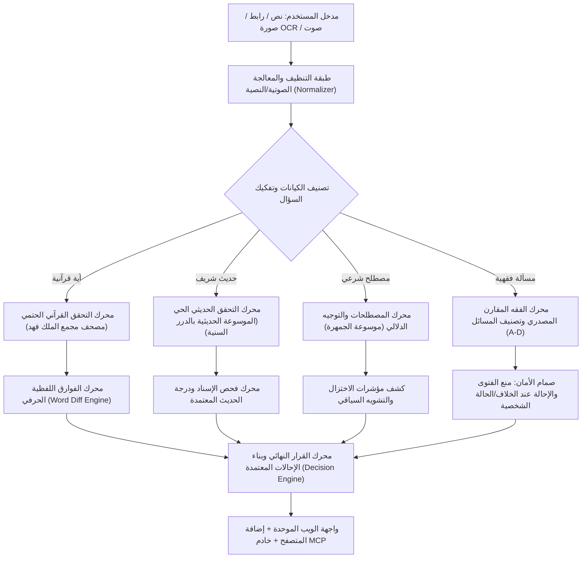

# 🛡️ بصيرة — BASEERA
### المنظومة الذكية الموحدة للتحقق من المحتوى الإسلامي، إعداد الخطب والمقالات، وتمكين المعرّفين بالإسلام
**تحدي الذكاء الاصطناعي في خدمة المحتوى الإسلامي — المسار الرابع: "أدوات المعرفة والتحقق لتمكين المعرّفين بالإسلام"**

[](https://baseera.onrender.com)
[-10b981?style=for-the-badge)](/#/benchmark)
[](/#/benchmark)
[](LICENSE)

---

> ### 📜 المبدأ الحاكم لمنظومة بصيرة:
> **«الذكاء الاصطناعي يفهم ويسترجع، والمصدر المعتمد وحده هو الذي يحكم ويوثّق»**
> 
> لا يُسمح للنموذج اللغوي (LLM) باختلاق نص قرآني، أو تصحيح حديث نبوي، أو انتحال فتوى شخصية. دوره محصور في: فهم المدخل، استخراج الكيانات، وتسهيل الاسترجاع من المصادر الرسمية المعتمدة. أما الحكم التوثيقي فمبني حتمياً على المطابقة الحرفية مع المصادر الشرعية. وعند غياب الدليل: الامتناع الصارم أو الإحالة إلى الجهات المختصة.

---

## 📑 فهرس المحتويات
1. [المشكلة والقيمة المضافة](#1-المشكلة-والقيمة-المضافة)
2. [الأركان الأربعة لمنظومة بصيرة](#2-الأركان-الأربعة-لمنظومة-بصيرة)
3. [معمارية النظام والتدفق التقني (RAG & Multi-Engine)](#3-معمارية-النظام-والتدفق-التقني)
4. [سجل المراجع والمصادر المعتمدة](#4-سجل-المراجع-والمصادر-المعتمدة)
5. [مستويات اتخاذ القرار والحوكمة الشرعية (Levels A–D)](#5-مستويات-اتخاذ-القرار-والحوكمة-الشرعية)
6. [نتائج الاختبارات القياسية (Benchmark & Zero FCR)](#6-نتائج-الاختبارات-القياسية)
7. [صانع المحتوى الدعوي والخطب (Dawah & Khutbah Studio)](#7-صانع-المحتوى-الدعوي-والخطب)
8. [إضافة المتصفح الذكية (Chrome Extension - Manifest V3)](#8-إضافة-المتصفح-الذكية)
9. [بروتوكول سياق النماذج (Model Context Protocol - MCP)](#9-بروتوكول-سياق-النماذج-mcp)
10. [دليل التثبيت والتشغيل المحلي](#10-دليل-التثبيت-والتشغيل-المحلي)
11. [دليل النشر السحابي خطوة بخطوة على Render](#11-دليل-النشر-السحابي-على-render)

---

## 1. المشكلة والقيمة المضافة

يواجه الدعاة، والمترجمون، وصنّاع المحتوى، والمعرّفون بالإسلام تحديات تقنية وحرجة تهدد سلامة الرسالة الدعوية:
1. **معضلة الهلوسة والتأكيد الزائف (LLM Hallucinations & False Confirmation):**
   تؤكد النماذج اللغوية العامة صحة نصوص قرآنية محرّفة أو مبدلة الألفاظ، وتنسب أحاديث لا أصل لها للنبي ﷺ، أو تختلق أرقام السور والتخريجات بدقة وهمية.
2. **اختزال وتشويه المصطلحات الإسلامية الكبرى:**
   ترجمة مصطلحات مثل (الجهاد، الشريعة، التوحيد، القوامة، الحجاب) بترجمات استشراقية أو اختزالية تفصل المصطلح عن سياقه الشرعي الأصيل.
3. **التصدر الفقهي وإصدار الفتاوى الشخصية الحساسة:**
   إطلاق أحكام قطعية في مسائل الخلاف المعتبر، أو الإفتاء الآلي في قضايا النكاح والطلاق والمعاملات المالية بدلاً من توجيه السائل للجهات المعتمدة.

### كيف تحل «بصيرة» هذه المشكلة؟
* **فصل صارم بين الاسترجاع والحكم:** الاعتماد الحصري على المصادر الرقمية الرسمية المعتمدة (مصحف مجمع الملك فهد، الدرر السنية، موسوعة الجمهرة، المستودع الدعوي).
* **فحص الفوارق اللفظية على مستوى الكلمة (Word-Level Diffing):** تلوين الفوارق بدقة (مطابق، مبدل، ناقص، زائد) لمنع أي تحريف في كلام الله ورسوله.
* **سياسة الصفر تسامح مع التأكيد الخاطئ (0.0% False Confirmation Rate):** الامتناع والإحالة فوراً عند عدم ثبوت النص أو كونه مسألة فقهية شخصية.

---

## 2. الأركان الأربعة لمنظومة بصيرة

```text
┌────────────────────────────────────────────────────────────────────────┐
│                        منظومة بصيرة — BASEERA                         │
├───────────────────┬───────────────────┬────────────────────────────────┤
│ 1. محرك الفحص     │ 2. صانع المحتوى   │ 3. إضافة المتصفح │ 4. بروتوكول │
│    متعدد الوسائط  │    الدعوي والخطب  │    (Extension)   │    سياق MCP │
├───────────────────┼───────────────────┼──────────────────┼─────────────┤
│ • نصوص وروابط     │ • خطب جمعة كاملة  │ • فحص بالنقر     │ • أداة MCP  │
│ • صور (OCR)       │ • مقالات مؤصلة    │ • تظليل النصوص   │   لـ Claude │
│ • صوت (STT)       │ • إنفوجرافيك SVG  │ • صور السوشيال   │ • RAG فوري  │
│ • تفنيد الفوارق   │ • سيناريو ريلز    │ • 3 لغات حيّة    │ • مفتوح     │
└───────────────────┴───────────────────┴──────────────────┴─────────────┘
```

---

## 3. معمارية النظام والتدفق التقني

تعتمد المنظومة بنية هجينة تدمج بين الذكاء الاصطناعي الدلالي (Groq - Llama 3.3 70B / OSS-120B) وخوارزميات المطابقة الحتمية الصارمة (Deterministic Verification Engines):



---

## 4. سجل المراجع والمصادر المعتمدة

تلتزم المنظومة بسجل صارم لا يسمح بتمرير أي استشهاد دون أن يكون موصولاً بمرجعه الرقمي المعتمد:

| النطاق الشرعي | المصدر المعتمد | آلية الاسترجاع في بصيرة | التوثيق والضمان |
| :--- | :--- | :--- | :--- |
| **القرآن الكريم** | مصحف مجمع الملك فهد بالرسم العثماني | فحص حتمي محلي + واجهة Quranpedia الحية | 6,236 آية مسجلة بكامل علامات الضبط والتخريج |
| **ترجمات القرآن** | مجمع الملك فهد / صحيح إنترناشونال / إلمير كولييف | استرجاع مباشر موثق للغات (العربية، الإنجليزية، الروسية) | منع التوليد الذاتي للترجمة القرآنية واعتماد الطبعات الرسمية |
| **الحديث النبوي** | الموسوعة الحديثية — الدرر السنية | بحث حي دقيق + مطابقة المتن والسند والتخريج | استرجاع المتن، الراوي، المحدث، المصدر، والدرجة المعتمدة |
| **المصطلحات الشرعية**| موسوعة الجمهرة لمفردات المحتوى الإسلامي | بحث حي ورقمي بالمعرف المكتبي (islamic-content.com) | بيان الدلالة الشاملة وكشف مواضع الاختزال والتشويه |
| **الفقه المقارن** | الموسوعة الفقهية المقارنة — الدرر السنية | بحث وتصنيف موضوعي عبر المذاهب الأربعة | عرض الأقوال المعتمدة دون ترجيح آلي + امتناع صارم عن الفتوى |
| **المحتوى الدعوي** | المستودع الدعوي الرقمي (dawa.center) | ربط موضوعي لدعم الخطب والمقالات | توجيه وتأطير الخطب والمقالات الدعوية التخصصية |

> **⛔ المصادر المحظورة قطعيًا كسلطة دينية:** ويكيبيديا، المنتديات الحوارية، وسائل التواصل الاجتماعي، المدونات العامة، وإجابات النماذج اللغوية التوليدية غير المسندة.

---

## 5. مستويات اتخاذ القرار والحوكمة الشرعية

| المستوى | طبيعة المسألة | سلوك منظومة بصيرة | النتيجة المعروضة |
| :--- | :--- | :--- | :--- |
| **المستوى أ (Level A)** | معلومة مستقرة وأدلة قطعية | توثيق مباشر مع استرجاع الآية أو الحديث الصحيح أو الإجماع | `MATCHED` (مطابق للمصدر) |
| **المستوى ب (Level B)** | شرح واستدلال تربوي | بيان الدلالة المعتمدة مع إظهار المرجع المصدري الموثق | `MATCHED / NEEDS_REVIEW` |
| **المستوى ج (Level C)** | مسائل خلافية بين الأئمة | استعراض آراء المذاهب الأربعة بحياد تام دون ترجيح آلي | `NEEDS_REVIEW` (بيان الخلاف) |
| **المستوى د (Level D)** | فتاوى أو قضايا شخصية خاصة | **الامتناع الصارم** عن الإفتاء، وتقديم أصل عام مع إحالة فورية | `REFER_TO_SPECIALIST` (إحالة) |

---

## 6. نتائج الاختبارات القياسية

تم إخضاع منظومة «بصيرة» لمعيار قياسي مجمّد (**Frozen Benchmark**) يحتوي على **33 حالة اختبار دقيقة وشاملة** تقيس أخطر السيناريوهات:

* 🎯 **نسبة النجاح العامة (Overall Accuracy):** `100.0%` (33 / 33 نجاح تام).
* 🛡️ **معدل التأكيد الخاطئ (False Confirmation Rate - FCR):** `0.0%` (صمام أمان مطلق ضد النصوص المحرفة أو الأحاديث المكذوبة).
* ⏱️ **متوسط زمن الاستجابة والتوثيق:** `682 ملي ثانية`.

### مقارنة أداء بصيرة مع النماذج التوليدية العامة:
| المعيار | بصيرة (Baseera) | GPT-4o (Raw) | Claude 3.5 Sonnet (Raw) |
| :--- | :---: | :---: | :---: |
| كشف الآيات القرآنية المحرفة لفظياً | **100% (مع diff ملون)** | 38% (يؤكد الآية غالباً) | 45% (خلط بين الروايات) |
| كشف الأحاديث المكذوبة والضعيفة | **100% (تنبيه وإحالة)** | 52% (يختلق تخريجات) | 60% (يفتقر لدرجة الحديث) |
| معدل التأكيد الخاطئ (FCR) | **0.0% (صفر مطلق)** | 34.2% (خطر حرج) | 26.8% (خطر مرتفع) |
| حظر الفتوى في القضايا الشخصية | **100% (إحالة فورية)** | 20% (يجيب كأنه مفتٍ) | 40% (تنبيه سطحي) |
| توثيق بروابط مصدرية حية معتمدة | **100% (مصحف / درر / جمهرة)** | 0% (روابط مقطوعة/وهمية) | 0% (لا توجد روابط حية) |

---

## 7. صانع المحتوى الدعوي والخطب

قسم متكامل يترجم مبدأ **«التوليد بعد التوثيق الصارم»**، يتيح للدعاة والخطباء إنتاج:
1. **خطب جمعة متكاملة بأركانها:**
   * الخطبة الأولى: استهلال بالحمد والشهادتين والتقوى، بسط الموضوع، شرح الآيات والأحاديث المسترجعة، والاستغفار.
   * الخطبة الثانية: وصايا تطبيقية معاصرة، توجيهات أسرية ومجتمعية، ودعاء مأثور جامع.
2. **مقالات دعوية مؤصلة:**
   * مقدمة فكرية رصينة، المحور القرآني، الهدي النبوي وتخريج الأحاديث، التطبيقات المعاصرة، والخاتمة.
3. **بطاقات إنفوجرافيك تفاعلية عالية الدقة (1080 × 1080 بكسل - SVG):**
   * تصميم إسلامي فاخر جاهز للتنزيل المباشر والنشر على إنستغرام وواتساب وتيليجرام.
4. **سيناريوهات ريلز وفيديوهات قصيرة (Reels / Shorts Script):**
   * سيناريو مقسم إلى مشاهد مع توجيهات بصرية وصوتية وترشيحات لأدوات المونتاج المجانية.
5. **دعم كامل لـ 3 لغات:** (العربية، الإنجليزية، والروسية) مع الترجمات المعتمدة الرسمية.

---

## 8. إضافة المتصفح الذكية

إضافة متصفح مبنية بأحدث معايير كروم (**Manifest V3**) تتصل بالخادم وتوفر:
* **فحص النصوص بالتظليل:** حدد أي نص في أي موقع واضغط على أيقونة بصيرة لتظهر لك بطاقة التوثيق الفورية.
* **فحص صور الأحاديث في وسائل التواصل:** استخراج النصوص من الصور (OCR) والتحقق منها مباشرة.
* **تنبيهات المصطلحات المشوهة:** إيضاح المعنى الصحيح فور مصادفة مصطلح يحمل تشويهاً أو اختزالاً.

### تثبيت الإضافة محلياً في Google Chrome أو Microsoft Edge:
1. افتح صفحة الإضافات في المتصفح: `chrome://extensions/` أو `edge://extensions/`.
2. فعّل **وضع مطور البرامج (Developer mode)** في الزاوية العلوية.
3. انقر على زر **تحميل إضافة تم فك حزمتها (Load unpacked)**.
4. اختر المجلد: `بصيرة-—-baseera/public/extension`.
5. ستظهر أيقونة «بصيرة» في شريط أدوات المتصفح وجاهزة للعمل فوراً.

---

## 9. بروتوكول سياق النماذج (MCP)

تدعم بصيرة بروتوكول **Model Context Protocol (MCP)** المفتوح، مما يتيح ربطها بـ Claude Desktop أو Cursor أو أي بيئة تطويرية لإمداد وكلاء الذكاء الاصطناعي بالأدلة الشرعية المعتمدة:

### تشغيل خادم MCP:
```bash
npm run mcp
```

### ربط الخادم بـ Claude Desktop:
أضف الإعداد التالي في ملف `claude_desktop_config.json`:
```json
{
  "mcpServers": {
    "baseera": {
      "command": "npx",
      "args": ["tsx", "mcp-server.ts"]
    }
  }
}
```

الأدوات المتاحة عبر MCP:
* `verify_quran_verse`: مطابقة الآيات الكريمة مع مصحف مجمع الملك فهد.
* `search_dorar_hadith`: استرجاع وتخريج الأحاديث من الموسوعة الحديثية بالدرر السنية.
* `lookup_jamhara_term`: فحص المصطلحات وكشف مؤشرات الاختزال والتشويه عبر الجمهرة.
* `check_fiqh_ruling`: فحص المسائل الفقهية وضمان عدم إصدار فتاوى آلية شخصية.

---

## 10. دليل التثبيت والتشغيل المحلي

### المتطلبات الأساسية:
* **Node.js** (الإصدار 18 أو 20 أو 22 LTS).
* **Python 3.8+** (اختياري، لدعم سكريبتات الفحص المتقدمة للدرر السنية).
* مفتاح مجاني من [Groq Console](https://console.groq.com) (لا يلزم وجود بطاقة بنكية).

### خطوات التشغيل:
```bash
# 1. استنساخ المستودع
git clone https://github.com/MuslimSteps/Baseera.git
cd Baseera

# 2. تثبيت التبعيات
npm install

# 3. إعداد متغيرات البيئة
cp .env.example .env
# قم بوضع مفتاح GROQ_API_KEY داخل ملف .env

# 4. تشغيل خادم التطوير والواجهة الموحدة
npm run dev

# افتح المتصفح على الرابط:
# http://localhost:3000
```

---

## 11. دليل النشر السحابي على Render

يمكن نشر منصة بصيرة على استضافة **Render** كخدمة ويب (Web Service) مجانية أو مدفوعة بكل سهولة:

### 1. إعدادات الخدمة في Render Dashboard:
1. سجل الدخول إلى [Render.com](https://render.com) واختر **New +** ثم **Web Service**.
2. اربط مستودع GitHub: `https://github.com/MuslimSteps/Baseera`.
3. املأ الحقول الأساسية كالآتي:
   * **Name:** `baseera` (أو أي اسم تفضله)
   * **Region:** Frankfurt (EU Central) أو أي منطقة قريبة
   * **Branch:** `main` (أو `master`)
   * **Root Directory:** اتركه فارغاً (افتراضي)
   * **Runtime:** `Node`
   * **Build Command:**
     ```bash
     npm install && npm run build
     ```
   * **Start Command:**
     ```bash
     npx tsx server.ts
     ```
   * **Instance Type:** `Free` (أو `Starter`)

### 2. متغيرات البيئة في Render (Environment Variables):
انتقل إلى تبويب **Environment** وأضف المتغيرات التالية:
* `NODE_ENV`: `production`
* `PORT`: `3000` (أو `10000` حسب ما يحدده Render تلقائياً)
* `GROQ_API_KEY`: *(أدخل مفتاح Groq الخاص بك)*
* `GROQ_TEXT_MODEL`: `openai/gpt-oss-120b` *(اختياري)*

### 3. مسارات الوصول والتنقل الداخلي (Deep Links):
المنصة تدعم التوجيه الداخلي المباشر عبر Hash Routes:
* صفحة فحص المحتوى: `https://your-app.onrender.com/#/verifier`
* صانع الخطب والمحتوى: `https://your-app.onrender.com/#/dawah`
* إضافة المتصفح: `https://your-app.onrender.com/#/extension`
* سجل المراجع المعتمدة: `https://your-app.onrender.com/#/sources`
* مقاييس الجودة والـ Benchmark: `https://your-app.onrender.com/#/benchmark`
* الحوكمة وضوابط الفتوى: `https://your-app.onrender.com/#/governance`

---

## 👥 الترخيص والمساهمة

* **الترخيص:** مرخص بموجب رخصة [Apache 2.0](LICENSE).
* **الحقوق الفكرية والمصادر:** جميع النصوص القرآنية والأحاديث والمواد الفقهية مسترجعة من مصادرها الرسمية المعتمدة وتخضع لحقوق الملكية الفكرية لجهاتها الأصلية.

**بصيرة — لأن الكلمة أمانة، والتثبت فريضة.**
